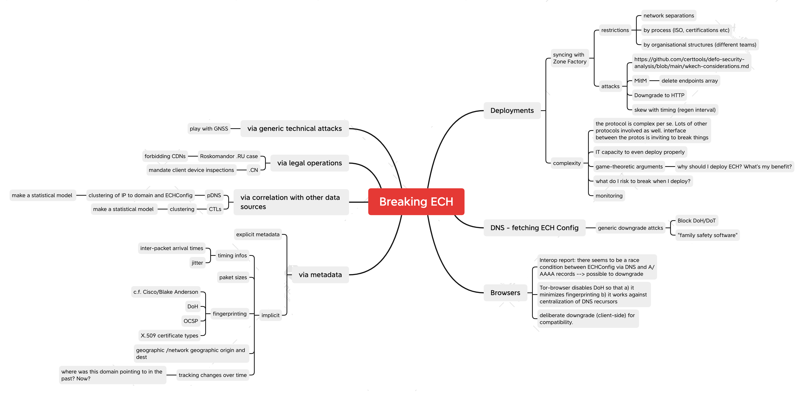

# defo-security-analysis

Security analysis of the defo2 project + HOWTO for web admins

## Deliverable text

Deployment Scenarios Analysis:  there are many variations in how ECH can be deployed and the varying relationships between the client and server entities involved. There therefore remains a need to map out residual privacy leaks in such scenarios and how to plug those, given the existence of additional privacy mechanisms such as Qname Minimization, Oblivious DNS-over-HTTPS, and MASQUE.

This task will accumulate practical documentation (for deployers) and analyses covering these issues.  It is clear ECH reduces metadata leakage, but it is not yet clear how censors might react. This task will audit and review the metadata in a properly functioning ECH interaction and explore remaining avenues for de-anonymisation, filtering, blocking and censorship. This touches relevant protocols required in an ECH setup, such as: DNS-over-HTTPS (DoH), DNS-over-TLS (DoT), OCSP (Online Certificate Status Protocol), certificate revocation list (CRLs), etc. We will also focus on “medium scale” web sites such as found on a University campus, smaller hosters or NREN member organisation – CDNs already see the benefits of ECH and have a clear path to deployment, but it is important to enable smaller, but still significant, scale organizations to enjoy the benefits of ECH. The task will result in one report.

## Background reading material

- Summary: https://en.wikipedia.org/wiki/Server_Name_Indication#Encrypted_Client_Hello
- RFC: https://datatracker.ietf.org/doc/draft-ietf-tls-esni/
- Well known for ECH (wkech): https://datatracker.ietf.org/doc/html/draft-ietf-tls-wkech
- Implementation details openssl: https://github.com/sftcd/openssl/blob/ECH-draft-13c/doc/designs/ech-api.md
- well-known for publishing ECH Keys: https://github.com/sftcd/wkesni (IETF Draft and Zone Factory scripts)
- Client Docker Image: https://github.com/defo-project/docker-defo-client
- Dev Utils: https://github.com/defo-project/ech-dev-utils
- Interop report: https://github.com/defo-project/ech-interop-report
- Test page: https://test.defo.ie/
- Build: https://github.com/defo-project#user-content-builderci-status-for-repos
- Russa blocking ESNI/ECH: https://therecord.media/russia-blocks-thousands-of-websites-that-use-cloudflare-service

# Attack ideas



# Report

## Generating the mkdocs documentation

```bash
virtualenv --python=python3.11 venv
source venv/bin/activate
pip install -r requirements.txt
cd report
mkdocs serve
```

Note well: we publish the documentation under github pages.

## Table of contents

- [Overview what we are going to analyse](analysis_plan.md)
- [Clients](Clients.md) -
- [Weaknesses in ECH in combination with WKECH](wkech-considerations.md)
