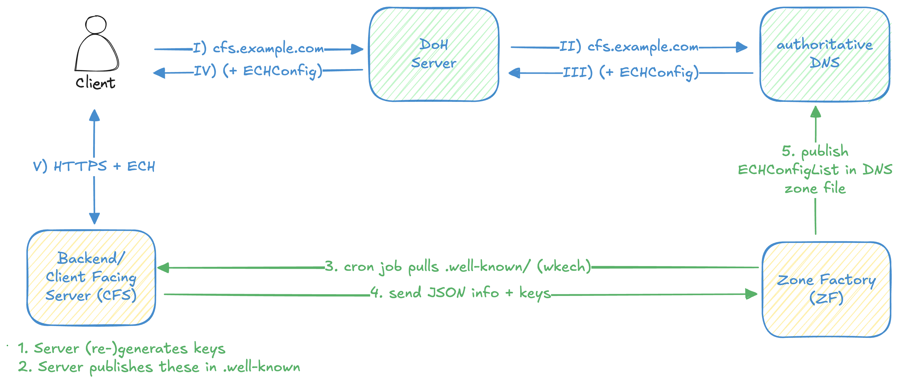

# Deployment considerations

This section explores ECH deployment considerations. Relevant links to additional sections will be provided, detailing potential attacks against the protocols.

## Process Overview

The following is a streamlined overview of the workflow involved when a browser accesses an ECH-protected website.

### Client-side Process

<ol>
<li style="list-style: upper-roman;">To initiate a website request, the browser first queries the A/AAAA records and the ECHConfig from the designated DoH (DNS over HTTPS) or DoT (DNS over TLS) server. This server may be provided by the network operator or a prominent Content Delivery Network (CDN).</li>
<li style="list-style: upper-roman;">The DoH server then queries the authoritative DNS server for the required information, which is managed by the website operator.</li>
<li style="list-style: upper-roman;">Once retrieved, the information is relayed from the authoritative DNS server to the DoH server, potentially being cached for future requests by this or other clients.</li>
<li style="list-style: upper-roman;">The DoH server subsequently transmits the information to the client.</li>
<li style="list-style: upper-roman;">Utilizing the A/AAAA records and the ECHConfig, the browser sends an HTTP request to the web server to fetch the website.</li>
</ol>

Typically, DoH servers communicate with authoritative DNS servers using traditional unencrypted UDP-based DNS (Do53). Nonetheless, the adoption of DoT and DoH protocols is on the rise. Additionally, various protocol upgrades (either opportunistic or through SVCB records) are possible.

### Server-side Process

1. The server regularly regenerates the ECH keys at defined intervals (for example, every hour) for each configured domain.
2. The server publishes the corresponding public ECH keys within the WKECH directories for every domain.
3. The Zone Factory (ZF) requests the ECH keys for each designated domain at pre-established intervals (preferably more frequent than once per hour).
4. The Client-Facing Server (CFS) responds with the requested ECH keys.
5. The ZF subsequently pushes the generated ECHConfig to the DNS server.

## Webserver configuration

On the webserver side, several considerations must be addressed:

- Which component generates the ECH keys with the appropriate parameters?
- Which entity handles the rotation of these keys and reloads the web server configuration?
- What component creates (or services) the WKECH directory, ensuring only public keys are exposed and private keys remain secure?
- How is the ZF triggered after each key rotation, ideally operating separately on a different host? (see [Separation](separation.md)).

There are similarities between the ACME protocols (made popular by the Letsencrypt initiative) and ECH, as both generate keys on the webserver and write information to the DNS zone.

To facilitate the ECH deployment, straightforward and easy tools, covering these processes, akin to ACME clients or Apache's [mod_md](https://httpd.apache.org/docs/2.4/mod/mod_md.html) need to be developed.

Guidance on setting up webservers with ECH, can be found in the ECH Dev utilites at <https://github.com/defo-project/ech-dev-utils#user-content-server-details>

## Complexity of Configuring the Zone Factory

The Zone Factory must be aware of the following:

1. Identifying well-known sites (`wkech`) to monitor.
2. Establishing a refresh schedule for the keys (either on a fixed interval or responsive to activity).
3. Knowing which zone files (housed on which servers) require updates.

The ZF requires write access to the zone files and must have the capability to reload the nameserver configuration. This setup is non-trivial for a systems administrator, as misconfigurations or oversights can introduce complications.

It is imperative to secure the WKECH directory: it must contain only public keys, be immutable (including to any aliases), and limit access solely to the web server itself. For more information, please refer to the section on [WKECH](../weaknesses/wkech.md).

## DNSSEC implementation

DNSSEC (Domain Name System Security Extensions) implementation is crucial to enable clients to validate ECH-enabled domains. This not only enhances the integrity of the DNS responses but also mitigates the risk of resolvers inadvertently blocking SVCB or ECH parameters.
