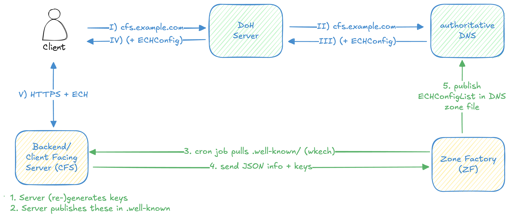

# Deployment considerations

This section addresses ECH deployment considerations. Where relevant, it will link to subsequent sections which details possible attacks against the protocols.

## Process overview

### Client process
1. To request a 

## Webserver configuration

- Which component creates the ECH keys with the correct parameters?
- Which component rotates them, and reloads the webserver?
- and creates (or serves) the wkech directory, ensuring that only the pubkeys are exposed, not the private keys
- Triggering the ZF after every rotation (running separately, on another host)
- documentation: https://github.com/defo-project/ech-dev-utils#user-content-server-details

## Complexity of configuering the ZF

The ZF needs to know 
1. which well-known sites (`wkech`) to look at 
2. which zone files need to be updated

The ZDF needs write access to the zone file and needs to be able to reload the nameserver. 
All of this flow is non-trivial for a sysadmin to configure. 

This sections looks at what could go wrong in case of misconfigurations or malicious attacks.

...

